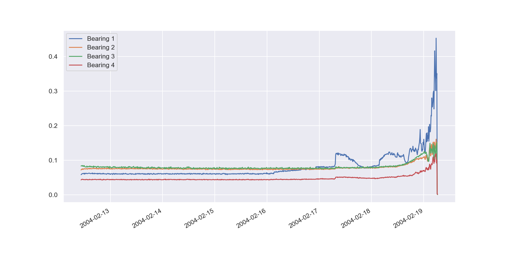

# NASA Bearing Dataset FFT-Analyse

In diesem Projekt wird eine Datenanalyse mit Fast Fourier Transform implementiert. 
Es basiert auf dem NASA IMS Bearing Dataset und demonstriert, wie Features daraus extrahiert werden können, 
um Ausfälle mittels Vibrationsdaten zu erkennen.

Die verwendeten Daten stammen aus dem zweiten Test des Datensatzes. Hierin werden Vibrationsmessungen von vier Kugellagern erfasst, 
die konstant bis zu einem Ausfall betrieben wurden.

- 4 Lager
- 20 kHz Abtastrate
- Alle 10 Minuten für 1 Sekunde gemessen
- 984 Messdateien
- Bearing 1 fällt in diesem Test aus
 
### Vibrationsdaten aller 4 Lager

## Verwendung von Fast Fourier Transform

FFT ist ein mathematisches Verfahren, welches ein Signal in einzelne Frequenzkomponenten zerlegen kann.
Für die Zustandsüberwachung von Maschinen kann dies verwendet werden, um Änderungen in Frequenzmustern frühzeitig zu erkennen.
Dies könnte beispielsweise eine Lockerung eines mechanischen Bauteils sein, welches die Vibrationen der Maschine verändert.

Betrachten wir beispielsweise die aufgeteilten Frequenzen von Lager 1 zu Beginn des Tests, können wir eine gleichmäßige Verteilung mit einer dominanten Grundfrequenz erkennen: 

Diese Frequenz bei 985.40 Hz mit einer Amplitude von 428.21 ist möglicherweise eine grundlegende Vibration des gesamten Versuchaufbaus.

  
4 Tage nach dieser Aufnahme verändern sich diese Frequenzen:  
Weitere Frequenzen steigen in ihrer Amplitude und die Vibrationen werden chaotischer.

  
Kurz vor dem Ausfall des Lagers steigen diese Frequenzen weiter an:

Durch diese Messungen können die Veränderungen der dominanten Frequenzen und Amplituden als Erkennungsmerkmal eines degradierenden Systems verwendet werden.

## Weitere Features
Neben FFT gibt es noch weitere messbare Veränderungen in den Vibrationsdaten.

### Root Mean Square

Der quadratische Mittelwert der Vibration. Es ist ein Maß für die Gesamtenergie des Signals.  
Steigt bei zunehmender Degradation, da mehr Energie durch Reibung entsteht.

### Peak to Peak

Die Differenz zwischen dem höchsten und niedrigsten Messwert im Signal.  
Zeigt starke Stöße oder Schockimpulse.  

### Crest Factor

Dies ist das Verhältnis zwischen dem Peak-Wert und dem RMS-Wert.  
> Crest Factor = Peak / RMS

Zeigt den Unterschied zwischen kontinuierlicher Vibration und impulsartigen Stößen.

### Kurtosis

Ein statistisches Maß dafür, wie steil oder spitz einer Verteilung.  
Erhöht sich bei Lagerschäden.  

## Labeling
Die Daten werden in drei Klassen unterteilt:
- 0 Gesund
- 1 Degradiert
- 2 Kritisch

Die Klassifizierung basiert auf der Verteilung der Vibrationsamplituden:

## Feature Verteilung nach Label
Folgend wird das Verhalten von Features innerhalb der Klassifizierungen dargestellt:

## Feature Korrelation
Korrelationen zwischen Features und Label

# Automatische Restlebensdauer-Vorhersage durch Machine-Learning
[WIP]

